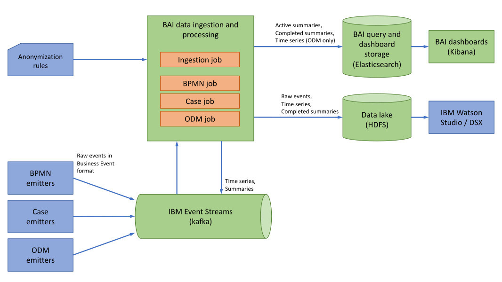

# Installing IBM Business Automation Insights on Certified Kubernetes

## Overview

IBM Business Automation Insights is a platform-level component that provides visualization insights to business owners and feeds a data lake to infuse artificial intelligence into IBM Digital Business Automation.

Based on state-of-the-art open source technologies, IBM Business Automation Insights captures all events that are generated by the operational systems implemented with the Digital Business Automation products, aggregates these events into business-relevant KPIs, and presents them in meaningful dashboards for lines of business to have a real-time view on their business operations.

### Entities

IBM Business Automation Insights processes and produces the following entities:

- Raw events: Native events that are ingested and processed by IBM Business Automation Insights.

- Time series: Simplified, flattened versions of raw events.

- Summaries: Aggregations of time series. For example, each process instance, activity instance, or case instance has a summary entity. Summaries describe the current state of the process, activity, or case instance, and compute their duration. Summaries are complete when the process, activity, or case is completed.

### Architecture diagram



### Deployed artifacts

When you install IBM Business Automations Insights, the following main elements are deployed:

- A `bai-admin` pod in charge of the IBM Business Automation Insights REST API.
- An Apache Flink cluster (`bai-jobmanager` and `bai-taskmanager`) hosting the IBM Business Automation Insights event processing.
- Optionally, an Elasticsearch and Kibana cluster to gather data from the event processing.

If you want to use an HDFS data lake, you must install it separately.

## Requirements

### Kubernetes cluster

IBM Business Automation Insights requires a certified Kubernetes platform
(see [support statement](../README.md#support-statement)).

### Helm command line interface

To install Helm, follow these [instructions](https://docs.helm.sh/using_helm/#installing-helm).

### Apache Kafka

An Apache Kafka cluster must be up and running before you deploy IBM Business Automation Insights.
The Apache Kafka connection must be configured in the Helm Chart values.

For a quick start, try [Confluent Apache Kafka Helm Chart](https://github.com/confluentinc/cp-helm-charts).

## Before you begin

### Connect to the cluster

1. Log in to your Kubernetes cluster.

   For example, on OpenShift:
   ```
   oc login https://CLUSTERIP:8443
   ```

2. Create a namespace where to deploy IBM Business Automation Insights.

   The following example uses `bai` as the namespace.
   ```sh
   kubectl create namespace bai
   ```

### Upload the images

You need to upload the IBM Business Automation Insights images to the docker registry of the Kubernetes cluster. See: [Download a product package from PPA and load the images](../README.md#download-ppa-and-load-images).

### Configure the storage

IBM Business Automation Insights requires a certain number of persistent volumes.

Apache Flink needs a persistent volume to store its internal state and to support fault tolerance and high availability.

Choose between dynamic provisioning or create the persistent volumes manually.

#### Dynamic provisioning

If you use dynamic provisioning, make sure to use a `StorageClass` with a `reclaimPolicy` set to `Retain`. Otherwise, you might lose your data when you reinstall IBM Business Automation Insights because a different persistent volume might be allocated.

Unless you intend to use the default `StorageClass` of your Kubernetes environment, you must set the following configuration properties with the `StorageClass` name to use: `flinkPv.storageClassName`, `ibm-dba-ek.data.storage.storageClass`, and `ibm-dba-ek.elasticsearch.data.snapshotStorage.storageClassName`.

You then need to set `persistence.useDynamicProvisioning`,`ibm-dba-ek.elasticsearch.data.storage.useDynamicProvisioning`, and `ibm-dba-ek.elasticsearch.data.snapshotStorage.useDynamicProvisioning` to `true` when you deploy IBM Business Automation Insights.

`ibm-dba-ek` settings are required only if you install embedded Elasticsearch.

#### Manual provisioning

If dynamic provisioning is not enabled on the Kubernetes cluster or if you prefer to control the provisioning, you must create persistent volumes from scratch.

1. Create a persistent volume for Apache Flink.

   It is recommended to apply the `Retain` reclaim policy to make sure that data is not lost when you install a new release of IBM Business Automation Insights.
Use the following YAML file to create a persistent volume. Replace the placeholders with the values that are appropriate for your environment.

```yaml
apiVersion: v1
kind: PersistentVolume
metadata:
  name: ibm-bai-pv
spec:
  accessModes:
  - ReadWriteMany
  capacity:
    storage: <storage_capacity>
  nfs:
    path: /export/NFS/ibm-bai-pv
    server: <server-ip>
  persistentVolumeReclaimPolicy: Retain
  claimRef:
    namespace: bai
    name: <my-pvc-name>
```

> **Note**: The `claimRef` section is optional. However, you must set it in production mode if you want to make sure that your release always uses the same volume and if you do not want to lose your data. If you add the `claimRef` section, you must also set the namespace and the name of the persistent volume claim, as in step 2.

2. *Optional*: Create a persistent volume claim for Apache Flink.

   Use the following YAML file to create a persistent volume claim. Replace the placeholders with the appropriate values.
The value of `<my-pvc-name>` must match the `claimRef` section of the persistent volume that you specify when you configure your Business Automation Insights installation. The `<storage-size>` value must be smaller than or equal to the value of the persistent volume storage capacity.
The persistent volume claim must provide enough space to fit the capacity set at installation time, that is, 20Gi by default.

```yaml
kind: PersistentVolumeClaim
apiVersion: v1
metadata:
  name: <my-pvc-name>
  namespace: bai
spec:
  storageClassName: ""
  accessModes:
    - ReadWriteMany
  resources:
    requests:
      storage: <storage_size>
```

3. If you use embedded Elasticsearch, create the persistent volumes for Elasticsearch.

   It is recommended to apply the `Retain` reclaim policy to make sure that data is not lost when you install a new release of IBM Business Automation Insights.
The following code sample creates persistent volumes and sets the reclaim policy for two data nodes and a master node.

```yaml
apiVersion: v1
kind: PersistentVolume
metadata:
  name: ibm-bai-ek-pv-0
spec:
  accessModes:
  - ReadWriteOnce
  capacity:
    storage: 10Gi
  nfs:
    path: /export/NFS/ibm-bai-ek-pv-0
    server: <server-ip>
  persistentVolumeReclaimPolicy: Retain
---
apiVersion: v1
kind: PersistentVolume
metadata:
  name: ibm-bai-ek-pv-1
spec:
  accessModes:
  - ReadWriteOnce
  capacity:
    storage: 10Gi
  nfs:
    path: /export/NFS/ibm-bai-ek-pv-1
    server: <server-ip>
  persistentVolumeReclaimPolicy: Retain
---
apiVersion: v1
kind: PersistentVolume
metadata:
  name: ibm-bai-ek-pv-2
spec:
  accessModes:
  - ReadWriteOnce
  capacity:
    storage: 10Gi
  nfs:
    path: /export/NFS/ibm-bai-ek-pv-2
    server: <server-ip>
  persistentVolumeReclaimPolicy: Retain
```

4. *Optional*: If you want to refine the binding of the persistent volumes, provide a `storageClassName` value in the persistent volume .yaml file and then reference it when you configure the IBM Business Automation Insights installation.

   Modify the sample [pv.yaml](./configuration/pv.yaml) and deploy it as follows:

   ```sh
   kubectl apply -f pv.yaml
   ```

#### Persistent volume access rights

The access rights to the persistent volumes are as follows:
- user `9999` and group `9999` must have read and write access to the Apache Flink persistent volume.

- user `1000` and group `1000` must have read and write access to the Elasticsearch persistent volumes.

### Configure the image policy

- If you use the docker registry of the Kubernetes cluster, the default image policy, `default-dockercfg-*`, is applied. Check it out by running the following command: 
```sh
kubectl get secrets -n bai | grep kubernetes.io/dockercfg
```

- If you use a docker registry that is external to the Kubernetes cluster, you must define an image policy to be able to access the docker registry:

```sh
kubectl create secret docker-registry <your-registrykey-name> --docker-server=<registry_url> --docker-username=<new_user> --docker-password=<your-pwd> --docker-email=<your-email-address> -n bai
```

### Configure the pod security policy

If you plan to use embedded Elasticsearch and Kibana (rather than an external Elasticsearch installation), and only in this case, you must ensure that the target namespace for the IBM Business Automation Insights deployment is bound to a pod security policy that supports running privileged containers.

By default, a Kubernetes service account might not have the permissions to deploy to the target namespace any pods that require privileged containers. To enable such a deployment, you must modify the default behavior by creating the appropriate `PodSecurityPolicy`, `ClusterRole`, and `ClusterRoleBinding` Kubernetes resources.

- In general, you can apply the sample [bai-pod-security-policy.yaml](./configuration/bai-pod-security-policy.yaml):

```sh
kubectl apply -f bai-pod-security-policy.yaml
kubectl create clusterrolebinding bai-clusterrolebinding --clusterrole=bai-clusterrole --group=system:serviceaccounts:bai
```

- On OpenShift, run the following command:

```sh
oc adm policy add-scc-to-user privileged -n bai -z default
```

## Installing

There are two ways to deploy IBM Business Automation Insights to the Kubernetes cluster:

### Install IBM Business Automation Insights by using the Helm chart and Tiller

Refer to [Helm instructions](./helm-charts/README.md).

### Install IBM Business Automation Insights by using Kubernetes YAML

Refer to [Kubernetes instructions](./k8s-yaml/README.md).

## Post-installation steps

IBM Business Automation Insights is correctly deployed when all the jobs are completed, all the pods are running and ready, and all the services are reachable.

- Monitor the status of the jobs and check that all of them are marked as successful by executing  the following command:
 ```sh
kubectl get jobs -n bai
```
- Monitor the status of the pods and check that all of them are in `Running` mode and with all their containers `Ready` (for example, 2/2) by executing the following command:
 ```sh
kubectl get pods -n bai
```
- Verify that all the services are reachable by accessing the corresponding URLs. 
When all the services have the default value for `serviceType`, that is, NodePort, the URLs are as follows:
 ```sh
export NODE_IP=$(kubectl cluster-info | grep "master" | awk 'match($0, /([0-9]{1,3}\.){3}[0-9]{1,3}/) { print substr( $0, RSTART, RLENGTH )}')
export ADMIN_NODE_PORT=$(kubectl get svc -n bai "bai-bai-admin-service" -o 'jsonpath={.spec.ports[?(@.targetPort=="admin-rest")].nodePort}')
export ES_NODE_PORT=$(kubectl get svc -n bai "bai-ibm-dba-ek-client" -o 'jsonpath={.spec.ports[?(@.targetPort=="es-rest")].nodePort}')
export KIBANA_NODE_PORT=$(kubectl get svc -n bai "bai-ibm-dba-ek-kibana" -o 'jsonpath={.spec.ports[?(@.targetPort=="kibana-ui")].nodePort}')
echo "Admin REST API: https://$NODE_IP:$ADMIN_NODE_PORT"
echo "Elasticsearch REST API: https://$NODE_IP:$ES_NODE_PORT"
echo "Kibana: https://$NODE_IP:$KIBANA_NODE_PORT"
```
Use the following default login/passwords to authenticate with Elasticsearch REST API and with Kibana:
- demo/demo
- admin/passw0rd

> **Note:** To check the Admin REST API status, use `https://$NODE_IP:$ADMIN_NODE_PORT/api/health`.

## Updating

Depending on the updates that you plan, you might have to deploy new versions of some batch jobs. Because completed jobs cannot be updated, you must delete them before performing the update. 

### Prerequisites

* Delete the batch jobs related to processing jobs if you plan to update parameters that affect the execution of processing jobs. These parameters include: Apache Flink settings (including RocksDB settings), Kafka configuration options, Elasticsearch general settings, and Kerberos authentication settings.
That is, properties in the values.yaml file that start with `flink.*`, `bpmn.*`, `ingestion.*`, `icm.*`, `odm.*`, `kafka.*`, `settings.*`, `kerberos.*`, or `elasticsearch.*`.
See the full list of properties in the [Configuration parameters](#configuration-parameters) section below.

  * Retrieve the job names: `kubectl get jobs --selector=release=<your-release> -n bai | grep -v setup`
  * Delete each job in the list: `kubectl delete job <job-name> -n bai`

* Delete the bai-setup job if you update the `elasticsearch.url` property to change the Elasticsearch instance used by your Business Automation Insights system.

  `kubectl delete job <your-release>-bai-setup -n bai`

* Delete all the batch jobs if you plan to update the docker images.

### Update IBM Business Automation Insights by using Helm

Refer to [Helm instructions](./helm-charts/README.md#update-the-helm-chart).

### Update IBM Business Automation Insights by using Kubernetes

Refer to [Kubernetes instructions](./k8s-yaml/README.md#update-ibm-business-automation-insights).

## Configuration parameters

Learn more about IBM Business Automation Insights and its configuration in the [Knowledge Center](https://www.ibm.com/support/knowledgecenter/SSYHZ8_18.0.x/com.ibm.dba.bai/topics/con_bai_overview.html).

### General configuration

Parameter                            | Description                        | Default value                     |
-------------------------------------|------------------------------------|-----------------------------------|
`persistence.useDynamicProvisioning` | Use dynamic provisioning           | `true`                            |
`settings.egress`                    | Enable data egress to Apache Kafka | `true`                            |
`settings.ingressTopic`              | Apache Kafka ingress topic         | `[Release name]-ibm-bai-ingress`   |
`settings.egressTopic`               | Apache Kafka egress topic          | `[Release name]-ibm-bai-egress`   |
`settings.serviceTopic`              | Apache Kafka service topic         | `[Release name]-ibm-bai-service`  |
`baiSecret`   | Name of a secret that is already deployed to Kubernetes. See [below](#baiSecret) for details.  | `None` |

#### baiSecret

A secret that contains the following keys:

- `admin.username`: the username to authenticate with the Admin REST API
- `admin.password`: the password to authenticate with the Admin REST API
- `kafka-username`: the username to authenticate with Kafka
- `kafka-password`: the password to authenticate with Kafka
- `flink-security-krb5-keytab`: the Kerberos Keytab
- `elasticsearch-username`: the Elasticsearch username. This key is only required if `elasticsearch.install` is set to `false`.
- `elasticsearch-password`: the Elasticsearch password. This key is only required if `elasticsearch.install` is set to `false`.

> **Note**: The secret must hold a value for each of these keys, even if their value is empty (when they are not relevant in your IBM Business Automation Insights configuration).
When you run `kubectl` to create a secret with empty values, you must turn validation off with the ` --validate=false` argument.

For example:
```
kubectl create -f bai-prereq-secret.yaml --validate=false
```

If `baiSecret` is defined, it overrides the following values:
- `admin.username`
- `admin.password`
- `kafka.username`
- `kafka.password`
- `kerberos.keytab`
- `elasticsearch.username`
- `elasticsearch.password`

### Docker registry details

Parameter                   | Description              | Default value  |
----------------------------|--------------------------|----------------|
`imageCredentials.registry` | Docker registry URL      |     None       |
`imageCredentials.username` | Docker registry username |     None       |
`imageCredentials.password` | Docker registry password |     None       |
`imageCredentials.imagePullSecret` | The imagePullSecret for docker images. See [below](#imagecredentials) for details. | None
`imagePullPolicy` | The image pull policy | None |

#### imageCredentials.imagePullSecret

If imagePullSecret is defined for docker images, it overrides the following values:
- `imageCredentials.registry`
- `imageCredentials.userName`
- `imageCredentials.password`

Here is the command to create such a secret:

```
kubectl create secret docker-registry regcred --docker-server=<docker_registry> --docker-username=<docker_username> --docker-password=<docker_password> --docker-email=<your email> -n <namespace>
```

### Apache Kafka

Parameter                         | Description                     | Default
----------------------------------|---------------------------------|--------
`kafka.bootstrapServers`          | Apache Kafka bootstrap servers | `kafka.bootstrapserver1.hostname:9093,kafka.bootstrapserver2.hostname:9093,kafka.bootstrapserver3.hostname:9093`
`kafka.securityProtocol`          | Apache Kafka `security.protocol` property value | `SASL_SSL`
`kafka.saslKerberosServiceName`   | Apache Kafka `sasl.kerberos.service.name` property value |
`kafka.serverCertificate`         | Apache Kafka server certificate for SSL communications (base64 encoded) |
`kafka.username`                  | Apache Kafka username |
`kafka.password`                  | Apache Kafka password |
`kafka.propertiesConfigMap`       | Name of a ConfigMap already deployed into Kubernetes and that contains Kafka consumer and producer properties |

### Elasticsearch settings

Parameter | Description | Default
----------|-------------|--------
`elasticsearch.install`                   | Specifies whether Elasticsearch and Kibana must be deployed by using the ibm-dba-ek subchart | `true`
`elasticsearch.url`       | Elasticsearch URL. Only relevant if you do not use the ibm-dba-ek subchart to install Elasticsearch.  | `http://elasticsearch:9200`
`elasticsearch.username`       | Elasticsearch username. Only relevant if you do not use the ibm-dba-ek subchart to install Elasticsearch.  |
`elasticsearch.password`       | Elasticsearch password. Only relevant if you do not use the ibm-dba-ek subchart to install Elasticsearch.  |
`elasticsearch.version`       | Elasticsearch version. Only relevant if you do not use the ibm-dba-ek subchart to install Elasticsearch.  |
`elasticsearch.serverCertificate` | Elasticsearch server certificate for SSL communications (base64 encoded). Only relevant if you set `Install Elasticsearch` to false.  |

### Setup job

Parameter | Description | Default
----------|-------------|--------
`setup.image.repository`           | Docker image name for the setup job | `bai-setup`
`setup.image.tag`           | Docker image version for the setup job | `latest`

### Administration service
Parameter | Description | Default
----------|-------------|--------
`admin.image.repository`           | Docker image name for the Administration Service | `bai-admin`
`admin.image.tag`           | Docker image version for the Administration Service | `latest`
`admin.replicas`          | Number of Administration Service replicas | 2
`admin.username`           | Sets the user name to the Administration Service | `admin`
`admin.password`           | Sets the password to the Administration Service API | `passw0rd`
`admin.serviceType`           | The way the Administration Service API must be exposed. Can be `NodePort` or `ClusterIP`. If you want to expose the service on Ingress, choose `ClusterIP`. After the Helm chart is deployed, you need to create your own Ingress Kubernetes resource manually. | `NodePort`
`admin.externalPort`           | The port to which the Administration Service API is exposed externally. Relevant only if `serviceType` is set to `NodePort`. |

### Apache Flink persistent volume

Parameter | Description | Default
----------|-------------|--------
`flinkPv.capacity`         | Persistent volume capacity                       | `20Gi`
`flinkPv.storageClassName` | Storage class name to be used if `persistence.useDynamicProvisioning` is `true`                      |
`flinkPv.existingClaimName`| By default, a new persistent volume claim is created. Specify an existing claim here if one is available.                       |

### Apache Flink

Parameter | Description | Default
----------|-------------|--------
`flink.image.repository`              | Docker image name for Apache Flink | `bai-flink`
`flink.image.tag`           | Docker image version for Apache Flink | `latest`
`flink.taskManagerHeapMemory`    | Apache Flink Task Manager heap memory (in megabytes) | 1024
`flink.taskManagerMemory`    | Apache Flink Task Manager total memory (in megabytes). It has to be greater than `flink.taskManagerHeapMemory`. | 1536
`flink.jobCheckpointingInterval` | Interval between checkpoints of Apache Flink jobs | `5000`
`flink.batchSize` | Batch size for bucketing sink storage | `268435456`
`flink.checkInterval` | How frequently (in milliseconds) the job checks for inactive buckets | `300000`
`flink.bucketThreshold` | Minimum time (in milliseconds) after which a bucket that does not receive new data is considered inactive | `900000`
`flink.storageBucketUrl` | The HDFS URL for long-term storage (e.g. `hdfs://<node_name>:<port>/bucket_path`) |
`flink.rocksDbPropertiesConfigMap` | Name of a ConfigMap already deployed into Kubernetes that contains advanced RocksDB properties |
`flink.log4jConfigMap` | Name of a configMap already deployed into Kubernetes that overrides the default bai-flink-log4j configMap |
`flink.hadoopConfigMap` | Name of a ConfigMap already deployed into Kubernetes that contains HDFS configuration (core-site.xml and hdfs-site.xml) |
`flink.zookeeper.image.repository`    | Docker image name for Apache Zookeeper | `bai-flink`
`flink.zookeeper.image.tag` | Docker image version for Apache Zookeeper | `latest`
`flink.zookeeper.replicas`     | Number of Apache Zookeeper replicas | 3

### IBM Business Automation Workflow - BPMN processing

Parameter | Description | Default
----------|-------------|--------
`bpmn.install`                   | Specifies whether BPMN event processing must be installed or not | `true`
`bpmn.image.repository`           | Docker image name for BPMN event processing | `bai-bpmn`
`bpmn.image.tag`           | Docker image version for BPMN event processing | `latest`
`bpmn.recoveryPath`           | The path to the savepoint or checkpoint from which a job recovers. You can use this path to restart the job from a previous state in case of failure. To use the default workflow of the job, leave this option empty. |
`bpmn.endAggregationDelay` | The delay in milliseconds before clearing the states used for summary transformation | `10000`
`bpmn.parallelism` | The number of parallel instances (task managers) to use for running the processing job |

### IBM Business Automation Workflow - Case processing

Parameter | Description | Default
----------|-------------|--------
`icm.install`                   | Specifies whether IBM Case Manager (ICM) event processing must be installed or not | `true`
`icm.image.repository`           | Docker image name for ICM event processing | `bai-icm`
`icm.image.tag`           | Docker image version for ICM event processing | `latest`
`icm.recoveryPath`           | The path to the savepoint or checkpoint from which a job recovers. You can use this path to restart the job from a previous state in case of failure. To use the default workflow of the job, leave this option empty. |
`icm.parallelism` | The number of parallel instances (task managers) to use for running the processing job |

### IBM Operational Decision Manager processing

Parameter | Description | Default
----------|-------------|--------
`odm.install`                   | Specifies whether IBM Operational Decision Manager (ODM) event processing must be installed or not | `true`
`odm.image.repository`           | Docker image name for ODM event processing | `bai-odm`
`odm.image.tag`           | Docker image version for ODM event processing | `latest`
`odm.recoveryPath`           | The path to the savepoint or checkpoint from which a job recovers. You can use this path to restart the job from a previous state in case of failure. To use the default workflow of the job, leave this option empty. |
`odm.parallelism` | The number of parallel instances (task managers) to use for running the processing job |
### Raw events processing

Parameter | Description | Default
----------|-------------|--------
`ingestion.install`                   | Specifies whether raw event processing must be installed or not | true
`ingestion.image.repository`           | Docker image name for raw events processing | `bai-ingestion`
`ingestion.image.tag`           | Docker image version for raw events processing | `latest`
`ingestion.recoveryPath`           | The path to the savepoint or checkpoint from which a job recovers. You can use this path to restart the job from a previous state in case of failure. To use the default workflow of the job, leave this option empty. |
`ingestion.parallelism` | The number of parallel instances (task managers) to use for running the processing job |

### Kerberos configuration

Parameter | Description | Default
----------|-------------|--------
`kerberos.enabledForKafka` | Set to true to enable Kerberos authentication to the Kafka server | `false`
`kerberos.enabledForHdfs` | Set to true to enable Kerberos authentication to the HDFS server | `false`
`kerberos.realm`      | Kerberos default realm name |
`kerberos.kdc`        | Kerberos key distribution center host |
`kerberos.principal`  | Sets the Kerberos principal to authenticate with |
`kerberos.keytab`     | Sets the Kerberos Keytab (base64 encoded) |

### Init Image configuration

Parameter | Description | Default
----------|-------------|--------
`initImage.image.repository`           | Docker image name for initialization containers | `bai-alpine`
`initImage.image.tag`           | Docker image version for initialization containers | `latest`
