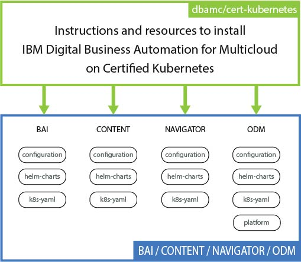

# IBM Digital Business Automation for Multicloud 18.0.2 on Certified Kubernetes

## Introduction

For information about Digital Business Automation for Multicloud 18.0.2, see [IBM Knowledge Center](https://www.ibm.com/support/knowledgecenter/SSYHZ8_18.0.x/welcome/kc_welcome_dba_distrib.html).

The installation of Digital Business Automation for Multicloud products uses Helm charts and Tiller or Kubernetes YAML files. The charts are packages of preconfigured Kubernetes resources that bootstrap a deployment on a Kubernetes cluster. You customize the deployment by changing and adding configuration parameters.

Installation is supported only on a Certified Kubernetes platform. There are dozens of Certified Kubernetes offerings and more coming to market each year. Cloud Native Computing Foundation (CNCF) has created a Certified Kubernetes Conformance Program, in which most of the leading vendors and cloud computing providers have Certified Kubernetes offerings. Use the following link to determine whether the vendor and/or platform is certified by CNCF https://landscape.cncf.io/category=platform. For more information about nonqualified platforms, see the [support statement for Certified Kubernetes](http://www.ibm.com/support/docview.wss?uid=ibm10876926).

> **Note**: Do not use these instructions to install the products on IBM Cloud Private. For more information, see [Installing products on IBM Cloud Private](https://www.ibm.com/support/knowledgecenter/SSYHZ8_18.0.x/com.ibm.dba.install/topics/tsk_install_icp.html).

## Legal Notice

Legal notice for users of this repository [legal-noice.md](legal-notice.md).

## Step 1: Prepare your environment

Before you install any of the containerized products, go to the [IBM Digital Business Automation for MultiCloud 18.0.x](https://www.ibm.com/support/knowledgecenter/SSYHZ8_18.0.x/com.ibm.dba.install/k8s_topics/tsk_install_kubernetes.html) Knowledge Center and follow the instructions on preparing your environment.

##  Step 2: Download a product package from PPA and load the images


[IBM Passport Advantage (PPA)](https://www-01.ibm.com/software/passportadvantage/pao_customer.html) provides a separate archive (.tgz) for each product. Download one or more PPA packages, and then run the loadimages.sh script to load the images into your Docker registry.

1. Download one or more PPA packages to a server that is connected to your Docker registry.
2. Download the [`loadimages.sh`](scripts/loadimages.sh) script from GitHub.
3. Login to the specified Docker registry with the docker login command.
4. Run the loadimages.sh script and specify the two mandatory parameters in the command line.

   > **Note**: The *docker-registry* value depends on the platform that you are using.

   ```
   -p  PPA archive files location or archive filename
   -r  Target Docker registry and namespace
   -l  Optional: Target a local registry
   ```
   
   > The following example shows the input values in the command line.

   ```
   # scripts/loadimages.sh -p /Downloads/PPA/ImageArchive.tgz -r docker-registry.default.svc:5000/demo-project
   ```

   The script extracts the archives from the PPA packages found in the specified location, then loads and tags the images in the target Docker registry. The script does not save the image archive files to disk. To save disk space and faster data processing it uses the memory cache.

## Step 3: Go to a product folder and follow the instructions

The repository includes one folder for each product.

| Folder 	| Product name 	| Version |
|------------	|----------------------------------	|------- |
| BAI 	| IBM Business Automation Insights | 18.0.2	|
| CONTENT 	| IBM FileNet Content Manager | 5.5.2	|
| NAVIGATOR 	| IBM Digital Business Navigator | 3.0.5 |
| ODM 	| IBM Operational Decision Manager | 8.10.1	|

Each product folder contains subfolders, which contain instructions and resources to install the Helm charts. The following diagram shows the structure of the repository.



You can install the products on a certified Kubernetes platform with the Helm command line interface (CLI) or the kubectl command line interface (CLI). Use the following links to go to the instructions for the product that you want to install.

- [Install IBM Business Automation Insights](BAI/README.md)
- [Install IBM FileNet Content Manager](CONTENT/README.md)
- [Install IBM Digital Business Navigator](NAVIGATOR/README.md)
- [Install IBM Operational Decision Manager](ODM/README.md)

